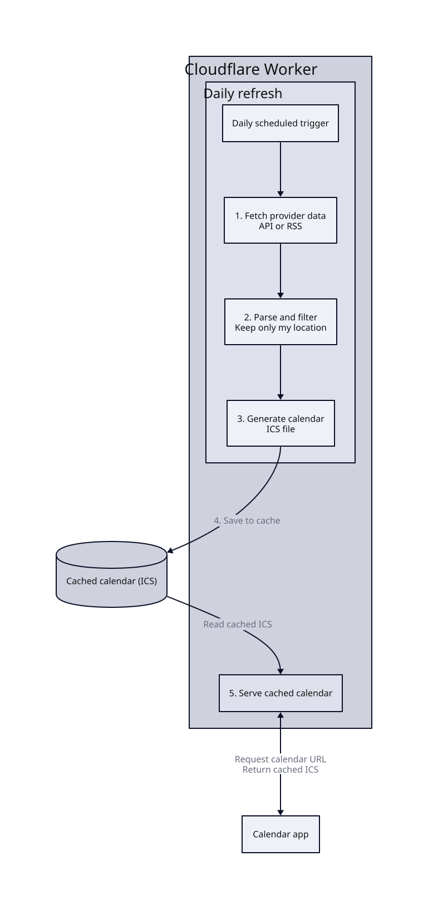

I recently became a bit annoyed with my local utility providers:

1. Trash collection schedule: you either need to download a PDF with schedule or install a mobile app. I did the latter, but the app is so bad that I don't want to use it. The PDF typically covers the whole year, so it doesn't automatically reflect schedule changes.
2. Electricity outages: you can sign up for email notifications about outages. That sounds useful, but the emails cover the whole county, so I receive alerts about outages scheduled for tomorrow in towns 30 km from my home.
3. Water outages: you can sign up for email notifications or download the app (as always), but, as with the electricity provider, I receive alerts about water outages in other towns.

I had been looking for a solution for a while when I came across Home Assistant integrations that use undocumented APIs to show trash collection schedules or electricity outages.

This gave me an idea: could I use an open format to bring everything into one app? What if I used the providers' APIs to generate an ICS calendar and subscribed to its URL in Apple Calendar? That would let me see trash collection dates with electricity and water outages in one place.

To host the calendar URL, I chose Cloudflare Workers because I already use Cloudflare for other projects. I split the Worker into two parts: one serves the cached ICS calendar, and the other fetches API or RSS data (the water provider has an RSS feed for outages), filters it to my location, and refreshes the cached calendar. The refresh runs once a day. Here's how it works:

I now have all the information in one place, without distractions, and only for the town I'm interested in. The calendar feed is updated daily and changes appear in Apple Calendar automatically.
